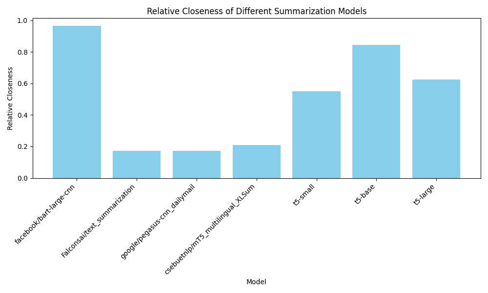

# Text Summarization Models - TOPSIS Evaluation

## Overview
This project implements **TOPSIS** (Technique for Order of Preference by Similarity to Ideal Solution) to evaluate and rank different pretrained text summarization models. The models are assessed based on standard evaluation metrics such as **ROUGE**, **BLEU**, and **BERTScore**.

---

## Dataset
- **Test Dataset** (`test.csv`): Contains articles and their corresponding summaries.
- **Evaluation Results** (`results.csv`): Includes the scores of various models across different evaluation metrics.

---

## Models Evaluated
The following pretrained models were tested:
1. `facebook/bart-large-cnn`
2. `Falconsai/text_summarization`
3. `google/pegasus-cnn_dailymail`
4. `csebuetnlp/mT5_multilingual_XLSum`
5. `t5-small`
6. `t5-base`
7. `t5-large`

---

## Metrics Used
1. **ROUGE** (Recall-Oriented Understudy for Gisting Evaluation):
   - ROUGE-1, ROUGE-2, and ROUGE-L measure similarity between generated and reference summaries.
2. **BLEU** (Bilingual Evaluation Understudy):
   - Evaluates the precision of generated summaries compared to references.
3. **BERTScore**:
   - Uses contextual embeddings to measure semantic similarity.
4. **TOPSIS Score**:
   - A multi-criteria decision-making method used to rank models based on the above metrics.

---

## Results
The models were ranked based on the TOPSIS method, and the best-performing model was `facebook/bart-large-cnn`. 

### Model Evaluation Table:

(Result.png)

---

## Visualization


The bar chart above shows the relative closeness of different models as calculated using the TOPSIS method.

---

## How to Use
1. Clone the repository:
   ```bash
   git clone https://github.com/your-repo-name.git
